# Final V11 thesis figures and results

The final V11 release, `results-v11-2026-09-15`, includes all 35 analytical
figure files, one cover emblem, ten table fragments and 268 aggregate input CSVs.
See the [V11 numerical reference](../docs/V11_RESULTS.md),
[version record](../docs/submission/v11_20260915/README.md),
[reproduction instructions](../docs/REPRODUCING_RESULTS.md) and [file manifest](manifest.json).

- `recomputed/`: final V11 figures, table rows and aggregate inputs.
- `submitted/`: historical 2026-09-14 assets, retained to document corrections.
- `static/sigillum.png`: the cover emblem, outside the statistical pipeline.

V11's maximum changed-transition accuracy is **16.3%**. Its **grouped** false
persistence range is **76.3%–100.0%**, over parsed changing transitions.
Earlier figures and table rows must not be quoted as V11 results.

Previews show V11. Filenames retain their original exporter names: the framework
is manuscript Figure 1, `Figure_1_information_ladder_print` is manuscript Figure 2,
and `Figure_4_persistence_heatmap_left_right_grouped_print` is manuscript Figure 4.
Each entry offers the final V11 asset and an explicitly labeled historical copy.

longitudinal_framework_overview

[Historical 2026-09-14 figure](submitted/figures/longitudinal_framework_overview.pdf) · [Final V11 figure](recomputed/figures/longitudinal_framework_overview.pdf)

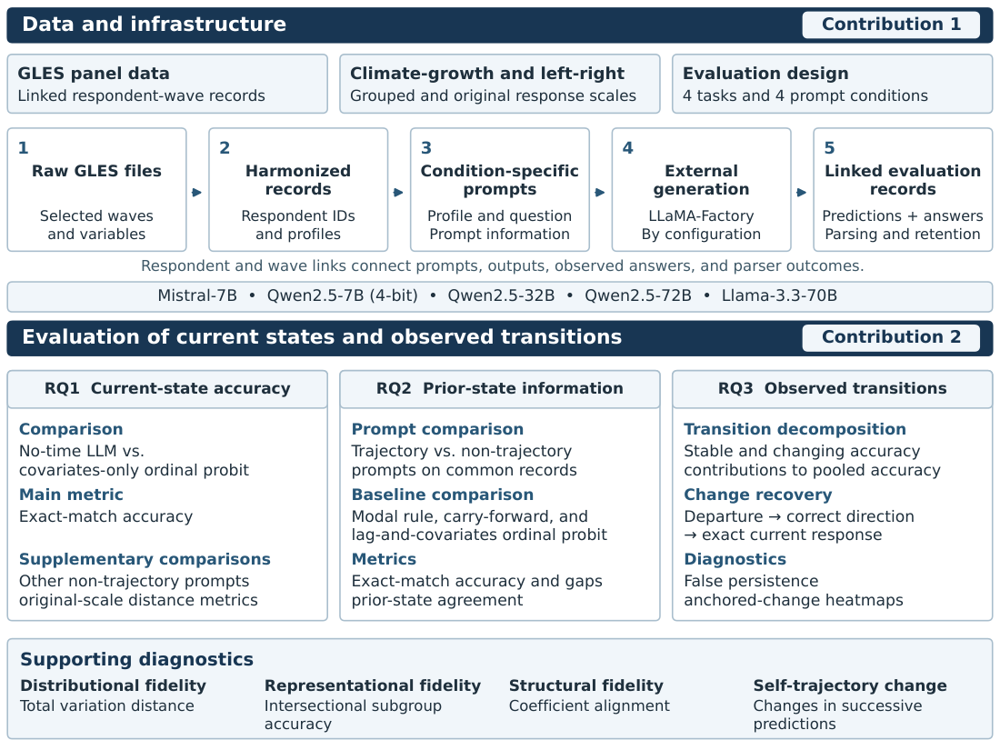

Figure_1_information_ladder_print

[Historical 2026-09-14 figure](submitted/figures/Figure_1_information_ladder_print.pdf) · [Final V11 figure](recomputed/figures/Figure_1_information_ladder_print.pdf)

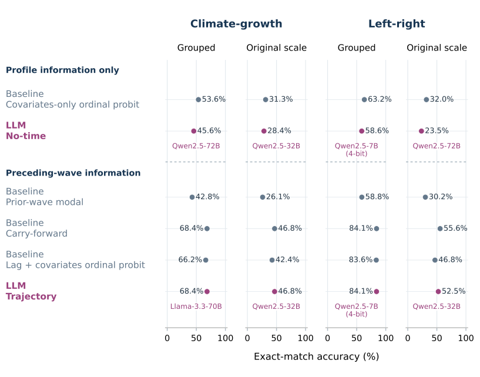

Figure_3_stable_changing_split_print

[Historical 2026-09-14 figure](submitted/figures/Figure_3_stable_changing_split_print.pdf) · [Final V11 figure](recomputed/figures/Figure_3_stable_changing_split_print.pdf)

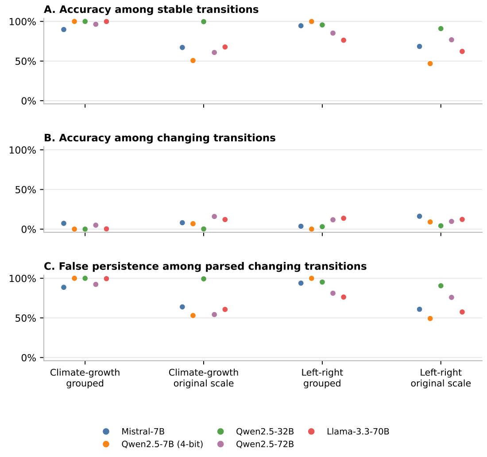

Figure_4_persistence_heatmap_left_right_grouped_print

[Historical 2026-09-14 figure](submitted/figures/Figure_4_persistence_heatmap_left_right_grouped_print.pdf) · [Final V11 figure](recomputed/figures/Figure_4_persistence_heatmap_left_right_grouped_print.pdf)

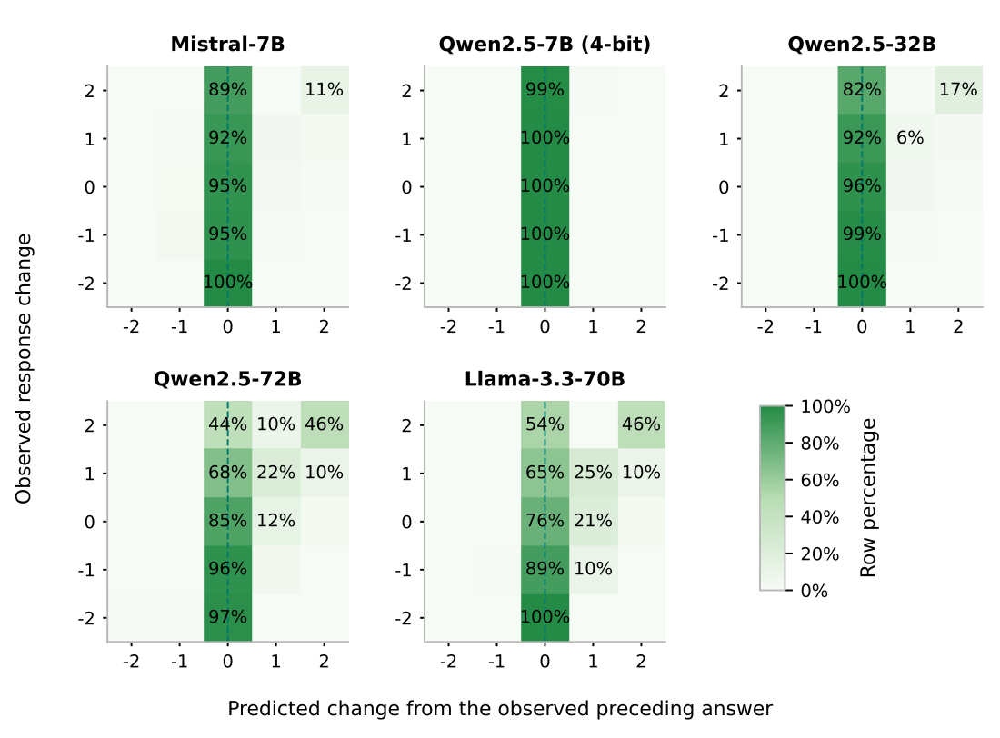

Figure_A1_trajectory_gain_print

[Historical 2026-09-14 figure](submitted/figures/Figure_A1_trajectory_gain_print.pdf) · [Final V11 figure](recomputed/figures/Figure_A1_trajectory_gain_print.pdf)

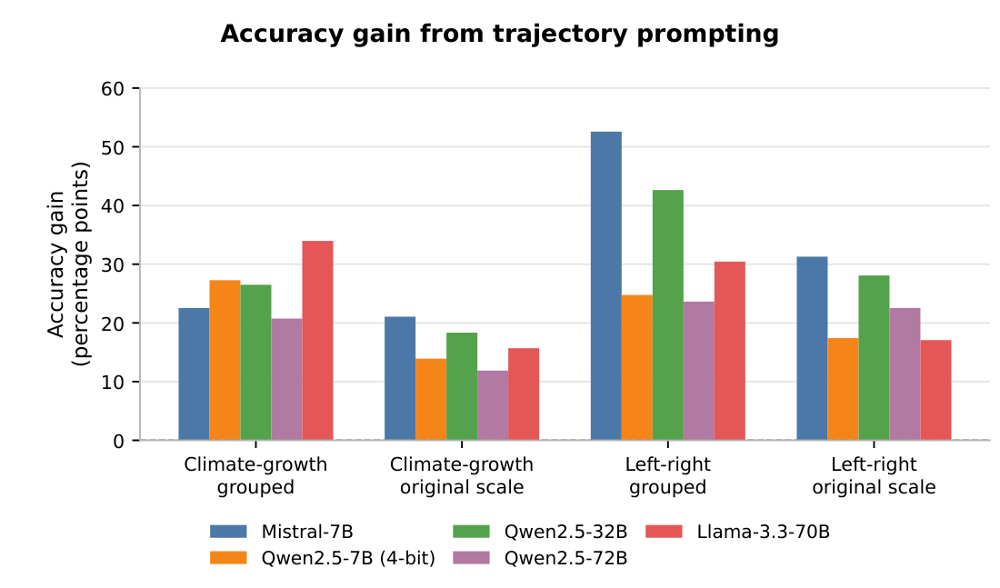

A1_common_sample_accuracy_overall

[Historical 2026-09-14 figure](submitted/figures/appendix/A1_common_sample_accuracy_overall.png) · [Final V11 figure](recomputed/figures/appendix/A1_common_sample_accuracy_overall.png)

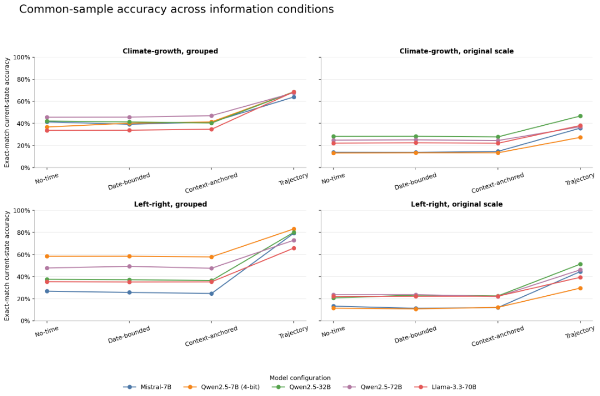

B1_climate_growth_grouped_all_prompts_vs_covariates_only_print

[Historical 2026-09-14 figure](submitted/figures/appendix/B1_climate_growth_grouped_all_prompts_vs_covariates_only_print.pdf) · [Final V11 figure](recomputed/figures/appendix/B1_climate_growth_grouped_all_prompts_vs_covariates_only_print.pdf)

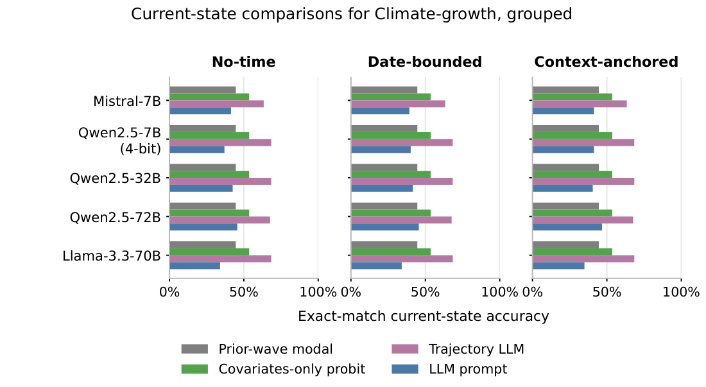

B2_climate_growth_original_all_prompts_vs_covariates_only_print

[Historical 2026-09-14 figure](submitted/figures/appendix/B2_climate_growth_original_all_prompts_vs_covariates_only_print.pdf) · [Final V11 figure](recomputed/figures/appendix/B2_climate_growth_original_all_prompts_vs_covariates_only_print.pdf)

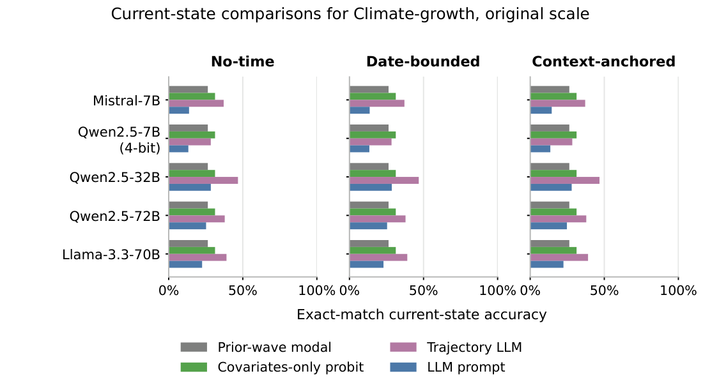

B3_left_right_grouped_all_prompts_vs_covariates_only_print

[Historical 2026-09-14 figure](submitted/figures/appendix/B3_left_right_grouped_all_prompts_vs_covariates_only_print.pdf) · [Final V11 figure](recomputed/figures/appendix/B3_left_right_grouped_all_prompts_vs_covariates_only_print.pdf)

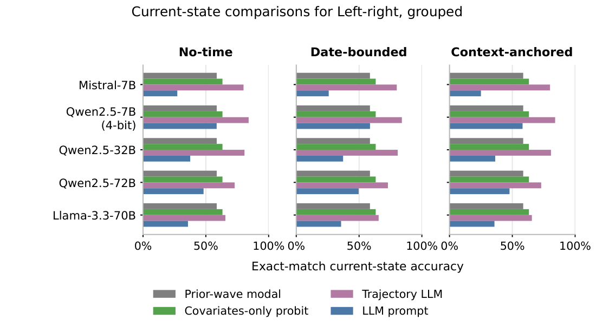

B4_left_right_original_all_prompts_vs_covariates_only_print

[Historical 2026-09-14 figure](submitted/figures/appendix/B4_left_right_original_all_prompts_vs_covariates_only_print.pdf) · [Final V11 figure](recomputed/figures/appendix/B4_left_right_original_all_prompts_vs_covariates_only_print.pdf)

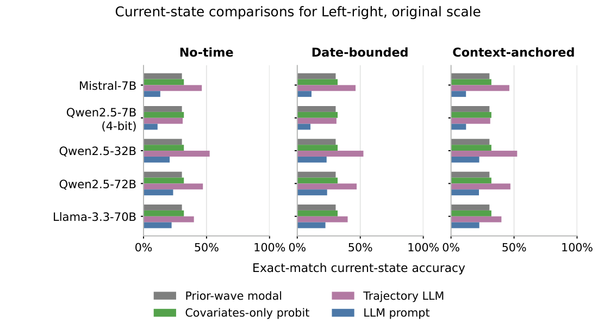

B5_climate_growth_grouped_trajectory_vs_nonllm_baselines

[Historical 2026-09-14 figure](submitted/figures/appendix/B5_climate_growth_grouped_trajectory_vs_nonllm_baselines.png) · [Final V11 figure](recomputed/figures/appendix/B5_climate_growth_grouped_trajectory_vs_nonllm_baselines.png)

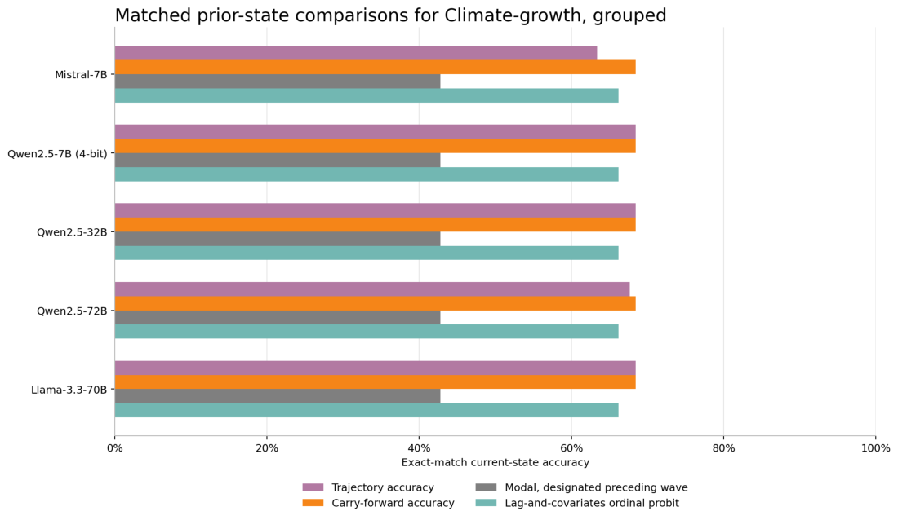

B6_climate_growth_original_trajectory_vs_nonllm_baselines

[Historical 2026-09-14 figure](submitted/figures/appendix/B6_climate_growth_original_trajectory_vs_nonllm_baselines.png) · [Final V11 figure](recomputed/figures/appendix/B6_climate_growth_original_trajectory_vs_nonllm_baselines.png)

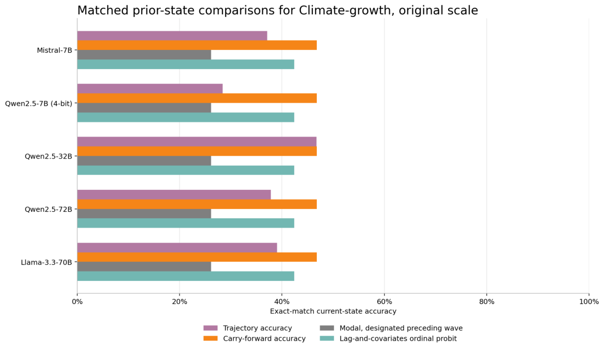

B7_left_right_grouped_trajectory_vs_nonllm_baselines

[Historical 2026-09-14 figure](submitted/figures/appendix/B7_left_right_grouped_trajectory_vs_nonllm_baselines.png) · [Final V11 figure](recomputed/figures/appendix/B7_left_right_grouped_trajectory_vs_nonllm_baselines.png)

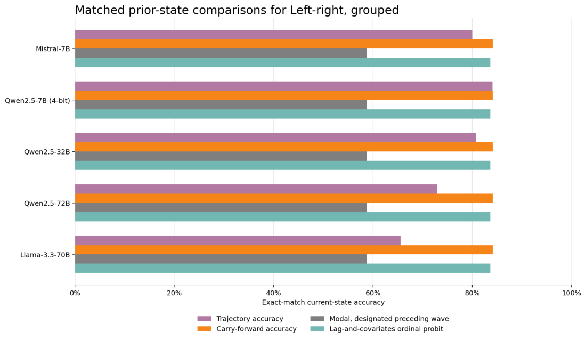

B8_left_right_original_trajectory_vs_nonllm_baselines

[Historical 2026-09-14 figure](submitted/figures/appendix/B8_left_right_original_trajectory_vs_nonllm_baselines.png) · [Final V11 figure](recomputed/figures/appendix/B8_left_right_original_trajectory_vs_nonllm_baselines.png)

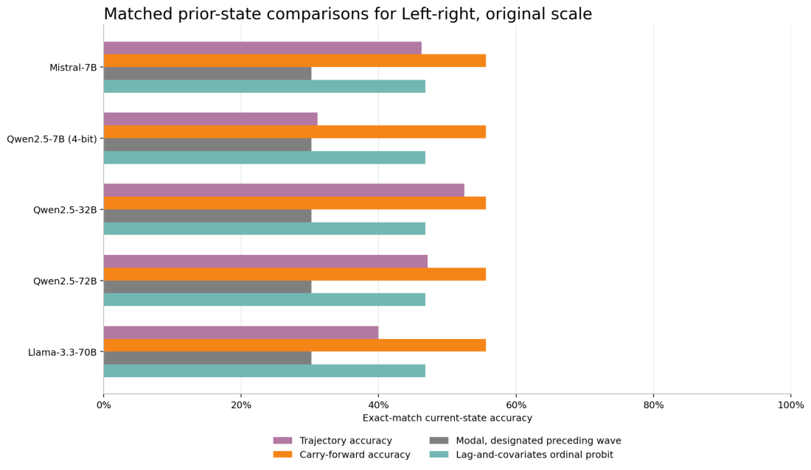

Figure_A7_model_scale_print

[Historical 2026-09-14 figure](submitted/figures/Figure_A7_model_scale_print.pdf) · [Final V11 figure](recomputed/figures/Figure_A7_model_scale_print.pdf)

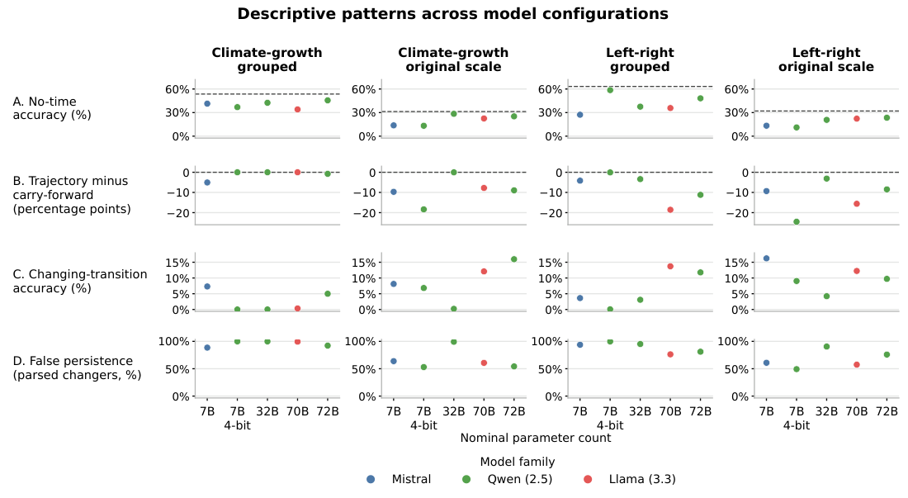

C0_aggregate_distribution_distance_overall

[Historical 2026-09-14 figure](submitted/figures/appendix/C0_aggregate_distribution_distance_overall.png) · [Final V11 figure](recomputed/figures/appendix/C0_aggregate_distribution_distance_overall.png)

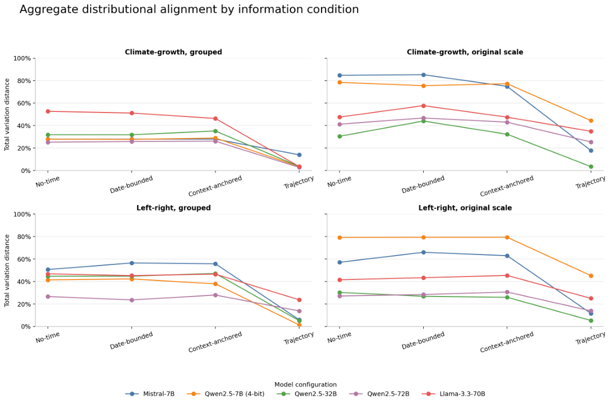

D05_climate_growth_grouped_anchored_change_heatmap_part1

[Historical 2026-09-14 figure](submitted/figures/appendix/D05_climate_growth_grouped_anchored_change_heatmap_part1.pdf) · [Final V11 figure](recomputed/figures/appendix/D05_climate_growth_grouped_anchored_change_heatmap_part1.pdf)

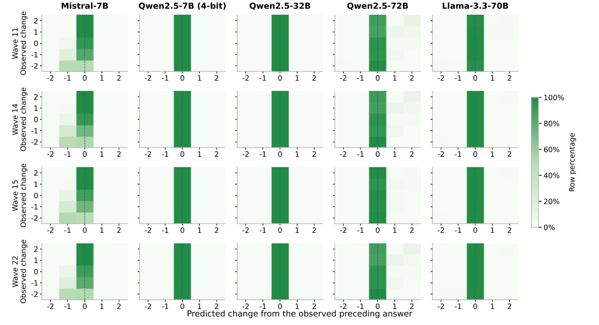

D05_climate_growth_grouped_anchored_change_heatmap_part2

[Historical 2026-09-14 figure](submitted/figures/appendix/D05_climate_growth_grouped_anchored_change_heatmap_part2.pdf) · [Final V11 figure](recomputed/figures/appendix/D05_climate_growth_grouped_anchored_change_heatmap_part2.pdf)

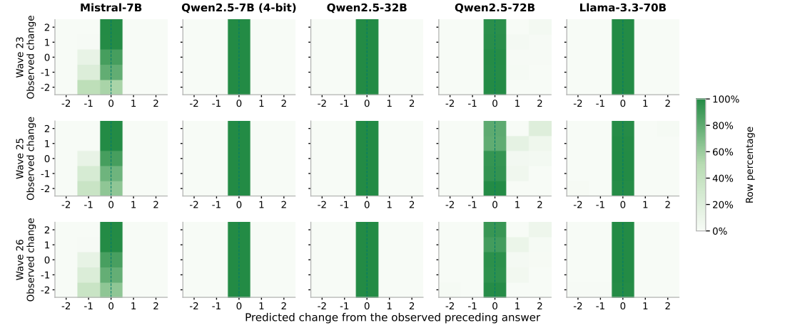

D06_climate_growth_original_anchored_change_heatmap_part1

[Historical 2026-09-14 figure](submitted/figures/appendix/D06_climate_growth_original_anchored_change_heatmap_part1.pdf) · [Final V11 figure](recomputed/figures/appendix/D06_climate_growth_original_anchored_change_heatmap_part1.pdf)

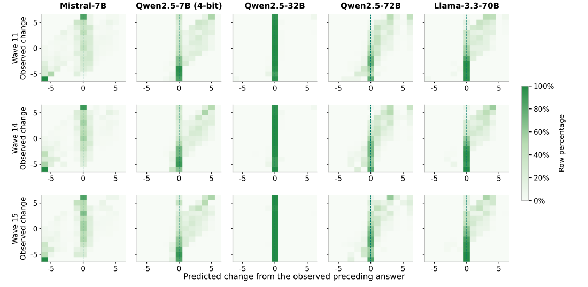

D06_climate_growth_original_anchored_change_heatmap_part2

[Historical 2026-09-14 figure](submitted/figures/appendix/D06_climate_growth_original_anchored_change_heatmap_part2.pdf) · [Final V11 figure](recomputed/figures/appendix/D06_climate_growth_original_anchored_change_heatmap_part2.pdf)

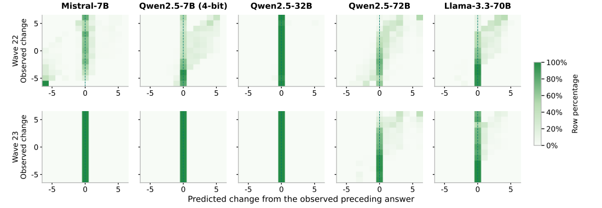

D06_climate_growth_original_anchored_change_heatmap_part3

[Historical 2026-09-14 figure](submitted/figures/appendix/D06_climate_growth_original_anchored_change_heatmap_part3.pdf) · [Final V11 figure](recomputed/figures/appendix/D06_climate_growth_original_anchored_change_heatmap_part3.pdf)

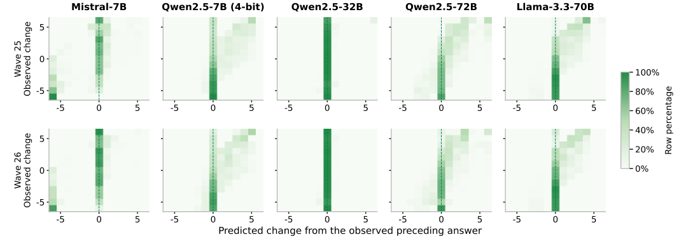

D07_left_right_grouped_anchored_change_heatmap_part1

[Historical 2026-09-14 figure](submitted/figures/appendix/D07_left_right_grouped_anchored_change_heatmap_part1.pdf) · [Final V11 figure](recomputed/figures/appendix/D07_left_right_grouped_anchored_change_heatmap_part1.pdf)

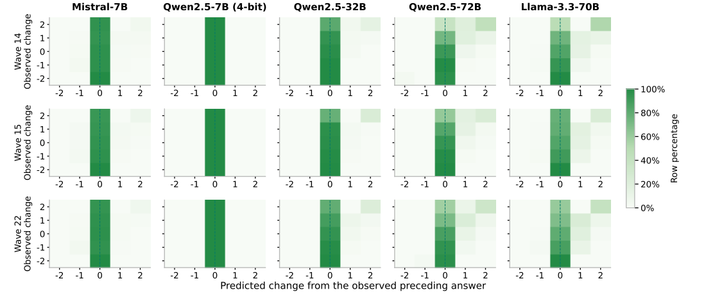

D07_left_right_grouped_anchored_change_heatmap_part2

[Historical 2026-09-14 figure](submitted/figures/appendix/D07_left_right_grouped_anchored_change_heatmap_part2.pdf) · [Final V11 figure](recomputed/figures/appendix/D07_left_right_grouped_anchored_change_heatmap_part2.pdf)

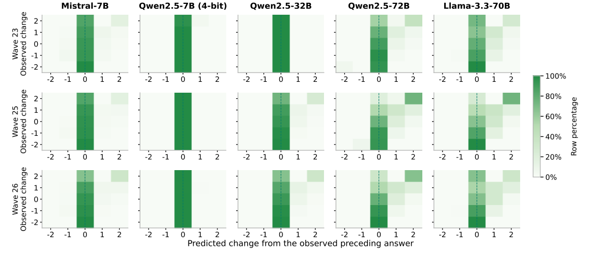

D08_left_right_original_anchored_change_heatmap_part1

[Historical 2026-09-14 figure](submitted/figures/appendix/D08_left_right_original_anchored_change_heatmap_part1.pdf) · [Final V11 figure](recomputed/figures/appendix/D08_left_right_original_anchored_change_heatmap_part1.pdf)

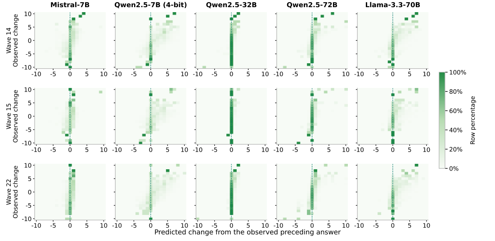

D08_left_right_original_anchored_change_heatmap_part2

[Historical 2026-09-14 figure](submitted/figures/appendix/D08_left_right_original_anchored_change_heatmap_part2.pdf) · [Final V11 figure](recomputed/figures/appendix/D08_left_right_original_anchored_change_heatmap_part2.pdf)

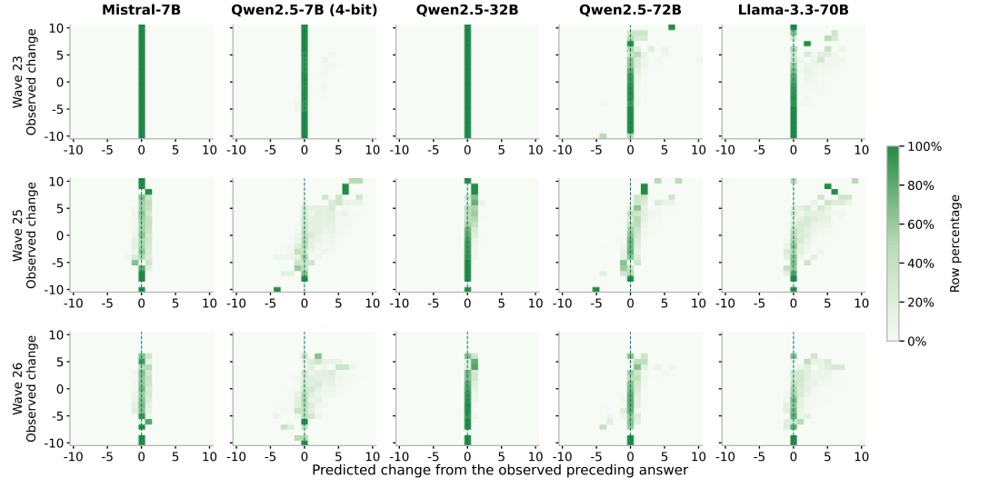

D09_climate_growth_grouped_self_trajectory_heatmap_part1

[Historical 2026-09-14 figure](submitted/figures/appendix/D09_climate_growth_grouped_self_trajectory_heatmap_part1.pdf) · [Final V11 figure](recomputed/figures/appendix/D09_climate_growth_grouped_self_trajectory_heatmap_part1.pdf)

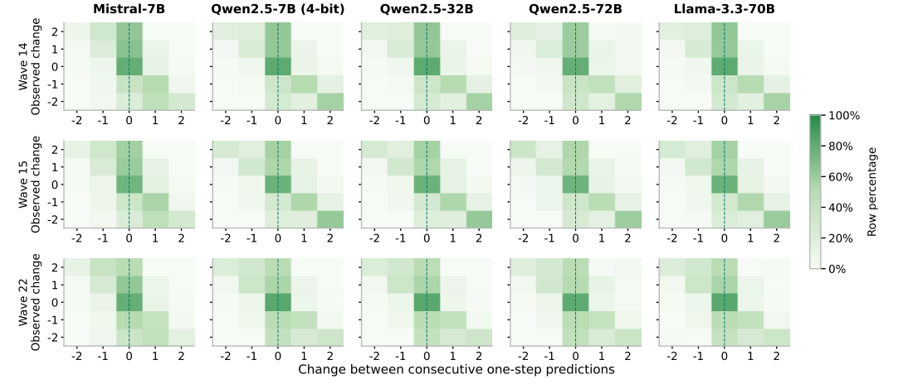

D09_climate_growth_grouped_self_trajectory_heatmap_part2

[Historical 2026-09-14 figure](submitted/figures/appendix/D09_climate_growth_grouped_self_trajectory_heatmap_part2.pdf) · [Final V11 figure](recomputed/figures/appendix/D09_climate_growth_grouped_self_trajectory_heatmap_part2.pdf)

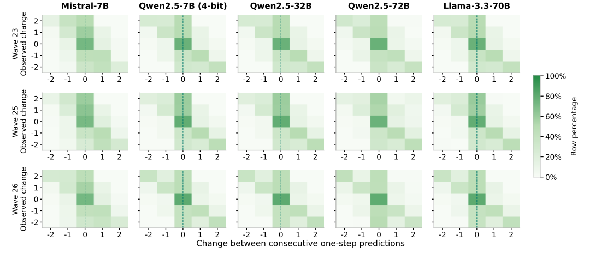

D10_climate_growth_original_self_trajectory_heatmap_part1

[Historical 2026-09-14 figure](submitted/figures/appendix/D10_climate_growth_original_self_trajectory_heatmap_part1.pdf) · [Final V11 figure](recomputed/figures/appendix/D10_climate_growth_original_self_trajectory_heatmap_part1.pdf)

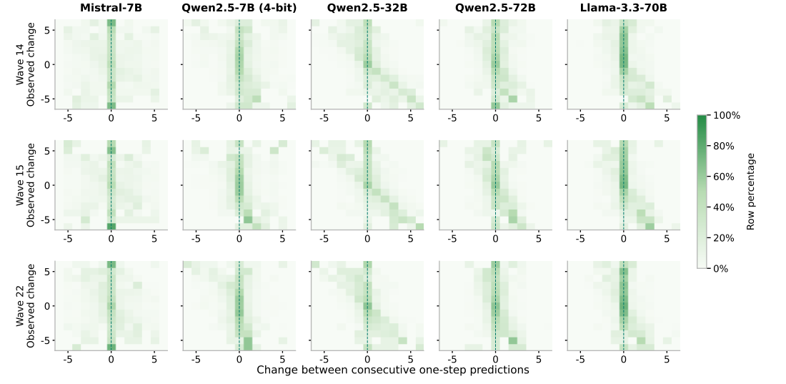

D10_climate_growth_original_self_trajectory_heatmap_part2

[Historical 2026-09-14 figure](submitted/figures/appendix/D10_climate_growth_original_self_trajectory_heatmap_part2.pdf) · [Final V11 figure](recomputed/figures/appendix/D10_climate_growth_original_self_trajectory_heatmap_part2.pdf)

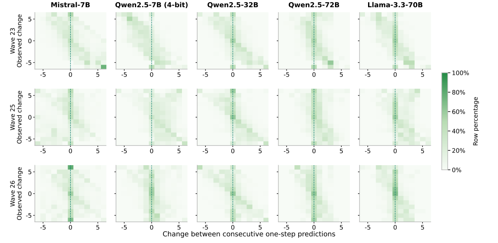

D11_left_right_grouped_self_trajectory_heatmap_part1

[Historical 2026-09-14 figure](submitted/figures/appendix/D11_left_right_grouped_self_trajectory_heatmap_part1.pdf) · [Final V11 figure](recomputed/figures/appendix/D11_left_right_grouped_self_trajectory_heatmap_part1.pdf)

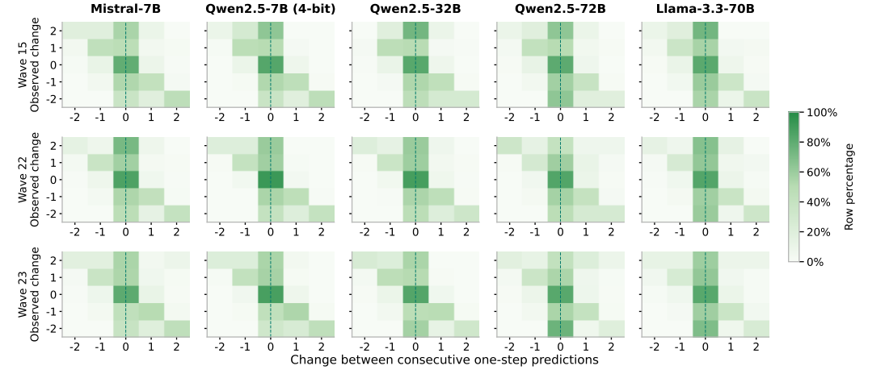

D11_left_right_grouped_self_trajectory_heatmap_part2

[Historical 2026-09-14 figure](submitted/figures/appendix/D11_left_right_grouped_self_trajectory_heatmap_part2.pdf) · [Final V11 figure](recomputed/figures/appendix/D11_left_right_grouped_self_trajectory_heatmap_part2.pdf)

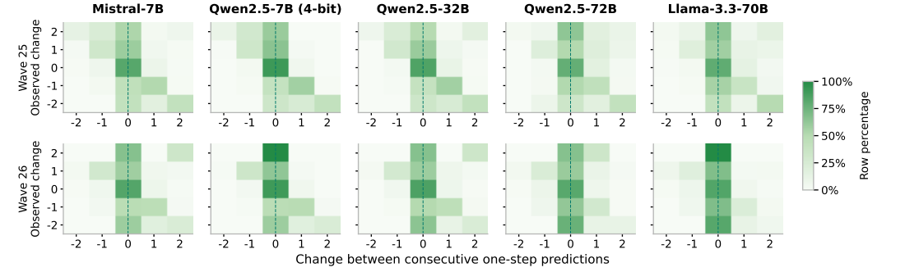

D12_left_right_original_self_trajectory_heatmap_part1

[Historical 2026-09-14 figure](submitted/figures/appendix/D12_left_right_original_self_trajectory_heatmap_part1.pdf) · [Final V11 figure](recomputed/figures/appendix/D12_left_right_original_self_trajectory_heatmap_part1.pdf)

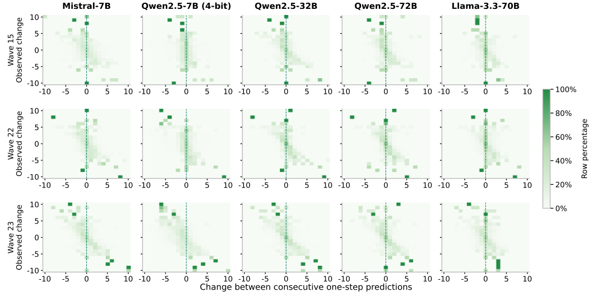

D12_left_right_original_self_trajectory_heatmap_part2

[Historical 2026-09-14 figure](submitted/figures/appendix/D12_left_right_original_self_trajectory_heatmap_part2.pdf) · [Final V11 figure](recomputed/figures/appendix/D12_left_right_original_self_trajectory_heatmap_part2.pdf)

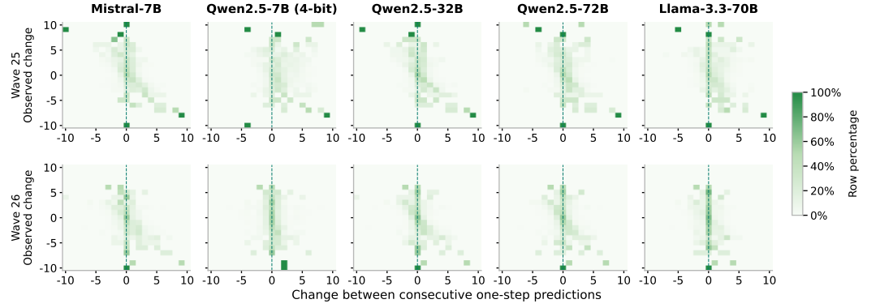

F_climate_growth_subgroup_print

[Historical 2026-09-14 figure](submitted/figures/appendix/F_climate_growth_subgroup_print.pdf) · [Final V11 figure](recomputed/figures/appendix/F_climate_growth_subgroup_print.pdf)

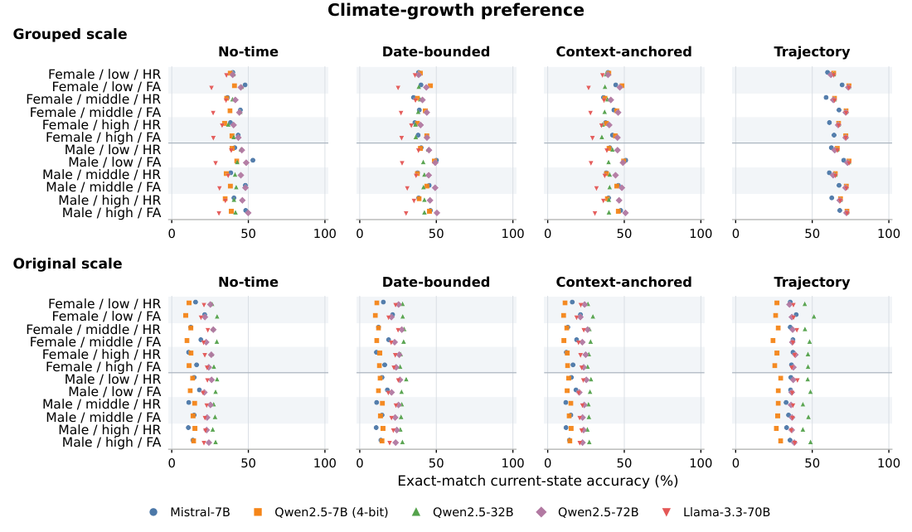

F_left_right_subgroup_print

[Historical 2026-09-14 figure](submitted/figures/appendix/F_left_right_subgroup_print.pdf) · [Final V11 figure](recomputed/figures/appendix/F_left_right_subgroup_print.pdf)

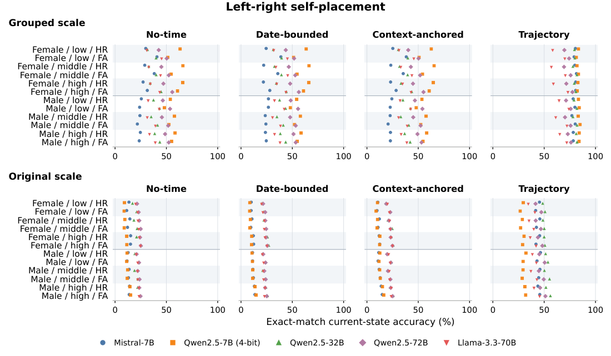

## Cover emblem

[Original sigillum.png](static/sigillum.png)

The emblem is reproduced from the supplied thesis source. Rights in the university emblem remain with its owner.
